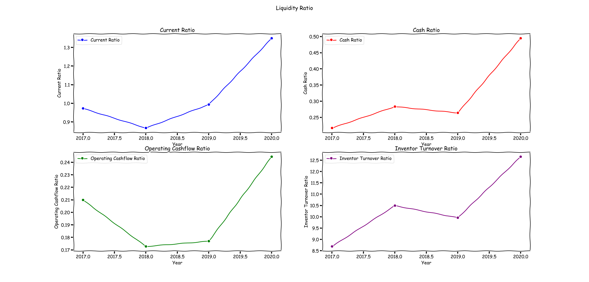
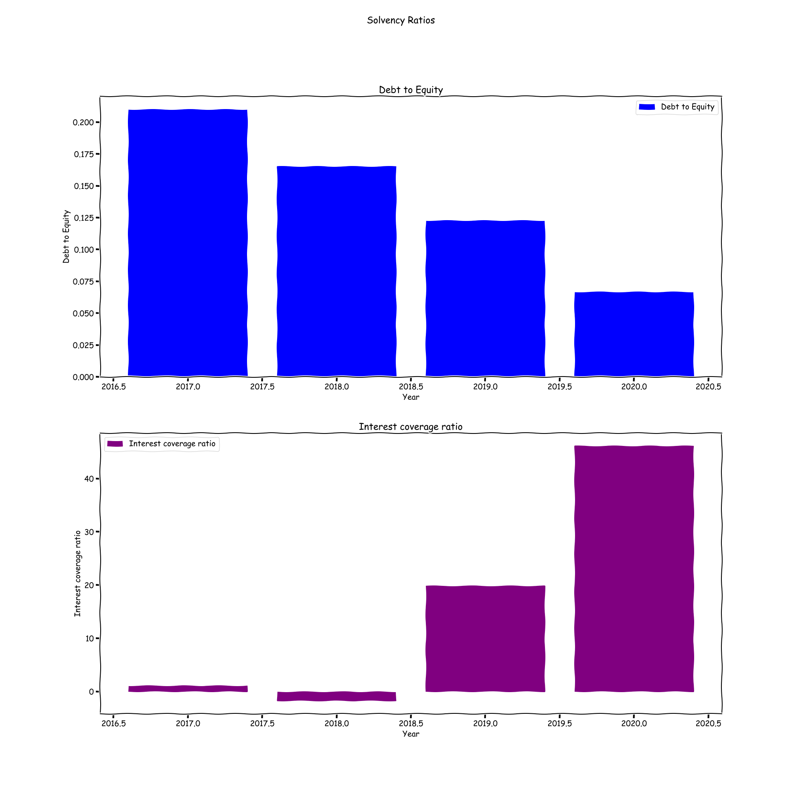
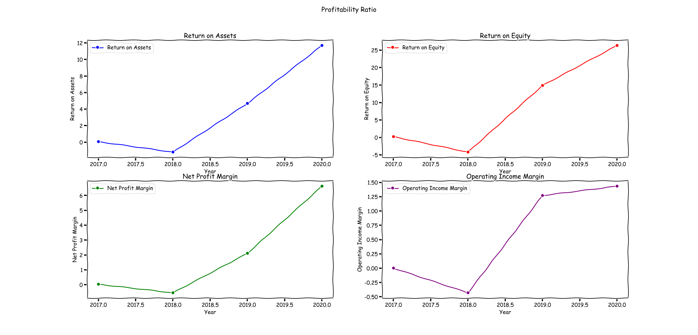

# Stock_Valuation_Bot

This project is developed to create an efficient and conservative "Stock Valuation Bot"
which uses the financial data in the form of .txt (typically copy pasted from yahoo finance) to 
derive a fair value of the stock. 

In this example Apple(AAPL) stock is valuated

# Base.py
Base.py is the base class which reads the financial statements as .txt files and formats the data to create a data 
frame which can be used for further analysis

Base.Py class has a method "variablefunction" where the variables are assigned with financial data. New variables must be defined here to 
use them later in the code 

# LiquidityRatio.py
This Subclass helps to calculate the Liquidity ratios such as 
- Current Ratio
- Cash Ratio
- Operating Cashflow Ratio, with the data which are now available as a dataframe from Base class method 'listformatter'^

# SolvencyRatio.py
This Subclass helps to calculate the Solvency ratios such as 
- Debt to Equity Ratio
- Interest Coverage Ratio

# ProfitabilityRatio.py
This Subclass helps to calculate the Profitability ratios such as 
- Return on Assets (ROA)
- Return on Equity (ROE)
- EBITDA Margin
- Net profit Margin
- Operating Income Margin

# DCF.py
This Subclass performs Discounted Cashflow valuation analysis by accessing the yahoo finance stock related data using
yfinance module.
To Valuate a different stock the Variable "self.stock_ticker" must be adjusted.  

# Plotter.py
A Class which is to plot the results from calculations and the data 

# logfile.log
Log file 
